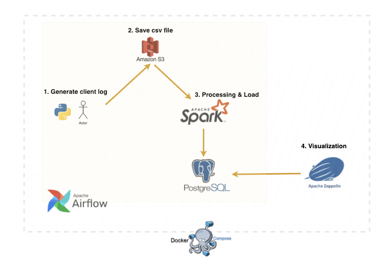
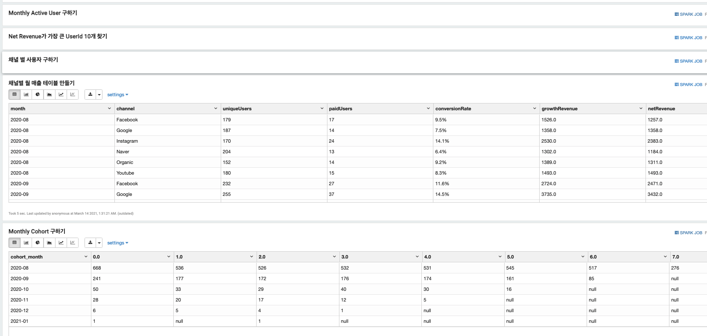
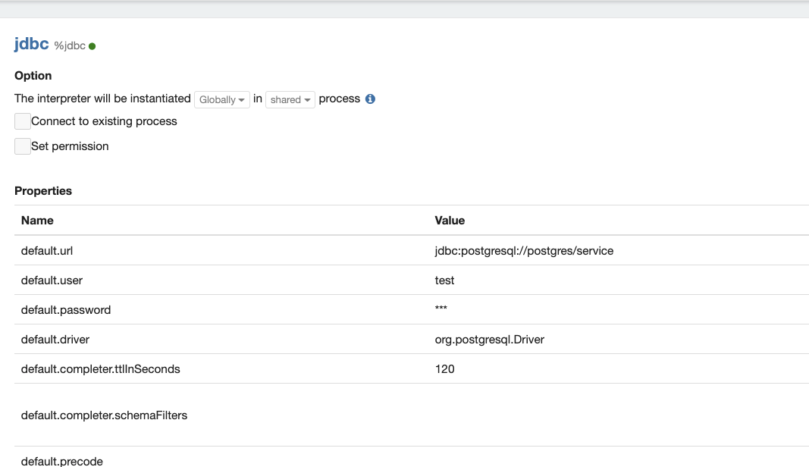

# READ ME

### Simple Data Pipeline Project

Docker Compose를 통해 컨테이너를 관리하였습니다.

1. Python을 통해 이전 7개월 간의 무작위 세션 & 트랜잭션 데이터를 생성하여 S3에 csv로 저장됩니다.
2. Spark에서 Transformation을 거쳐 Postgresql에 저장됩니다.
3. 저장된 정형 데이터는 Zeppelin에서 시각화할 수 있습니다.



**Airflow** 

- localhost:9000
- LocalExecutor 설정

**Spark**

- localhost:8181
- 1개의 master와 1개의 worker로 구성

**Postgres**

- localhost:5329

**Zeppelin**

- localhost:8080



## Getting Started

```bash
docker-compose up -d
```

## Prerequisites

### S3

1. aws S3 Bucket & IAM 생성이 필요합니다. 
2. airflow에서 s3_connection에서 key 값을 추가해야 합니다.
    - aws_access_key_id (access key 값)
    - aws_secret_access_key (secrey key 값)
      


### Zeppelin

1. Zeppelin jdbc 설정을 통해 postgresql 설정을 해줍니다.  
    - default.url : jdbc:postgresql://postgres/service
    - default.user : test
    - default.password : test



## TODO

- [ ]  대용량 데이터 시뮬레이션
- [ ]  스트리밍 환경(Kafka, Spark Streaming) 구축해보기
- [ ]  클라우드 환경(Kuberenetes, EC2, EMR)으로 확장해보기